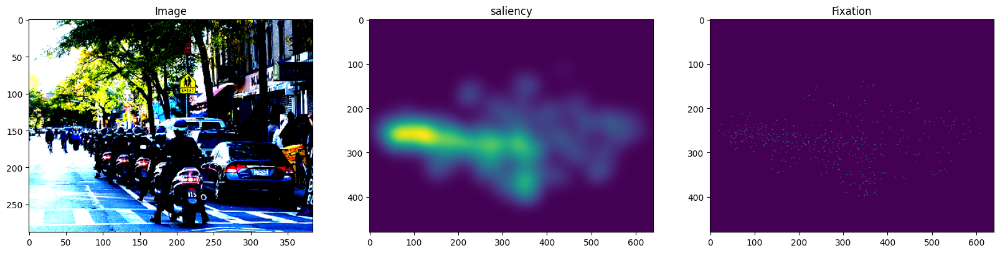
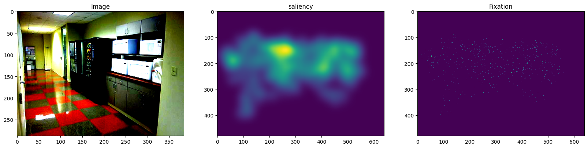

# Trainer for UNISAL Model

Simplified implementation of the UNISAL model for saliency using PyTorch. This code includes training and validation features, as well as checkpoint management.


  
  

## Table of Contents

- [Features](#features)
- [Installation](#installation)
- [Usage](#usage)
- [Arguments](#arguments)
- [Databases](#databases)
- [Example Usage](#example-usage)
- [Contributions](#contributions)

## Features

- Loading and training of a UNISAL model.
- Support for training and validation.
- Saving checkpoints at regular intervals.
- Customizing hyperparameters via command-line arguments.
- Export Onnx model.

## Installation

Make sure you have Python and PyTorch installed on your system. You can install the required dependencies with pip:

```bash
pip install -r requirements.txt
```

### Dependencies
- Python 3.11.9
- PyTorch
- OpenCV
- Matplotlib
- NumPy

## Usage

To run the training script, use the following command in the terminal:

```bash
python trainer.py --num_epochs 100 --path_save ./weights/
```

You can adjust the parameters based on your needs.

## Arguments

Here are the arguments you can use to customize the training:

| Argument               | Type     | Description                                          | Default Value           |
|-----------------------|----------|----------------------------------------------------|-----------------------------|
| `--num_epochs`        | `int`    | Number of epochs for training.                     | `100`                       |
| `--optim_algo`        | `str`    | Optimization algorithm.                            | `"SGD"`                     |
| `--momentum`          | `float`  | Momentum for the optimizer.                        | `0.9`                       |
| `--cnn_weight_decay`  | `float`  | Weight decay for the CNN.                          | `1e-5`                      |
| `--grad_clip`         | `float`  | Gradient clipping value.                           | `2.0`                       |
| `--cnn_lr_factor`     | `float`  | Learning rate factor for the CNN.                  | `0.1`                       |
| `--loss_metrics`      | `str[]`  | Loss metrics to use.                               | `["kld", "nss", "cc"]`     |
| `--loss_weights`      | `float[]`| Weights of the loss metrics.                       | `[1, -0.1, -0.1]`          |
| `--chkpnt_warmup`     | `int`    | Warmup epochs for checkpoint.                      | `2`                         |
| `--chkpnt_epochs`     | `int`    | Number of epochs to save the checkpoint.           | `2`                         |
| `--path_save`         | `str`    | Path to save the model weights.                    | `./weights/packging_1s/`    |

## Databases

Data structure for training:

- image: A tensor containing the input images (format: [batch_size, channels, height, width])
- saliency: A tensor containing the corresponding saliency maps (format: [batch_size, channels, height, width])
- fixation: A tensor containing the fixation points (format: [batch_size, channels, height, width])
- target_size: The target size of the images, used for resizing.






Create setting.py for databases informations
````

DATASET_PATHS = {

    'Name Database': {
        'source' : 'type sources if finetune Unisal [SALICON , DHF1K, UCFSport etc ..] else as you want',
        'type' : 'Image or Video',
        'train': "path train dataset",
        'val': "path val dataset",
        'extension' : "jpg / png / jpeg extensions images",
        'input_size' : (W,H) dimension input size,
        'target_size' : (W,H) dimensio target size
    },
}


````


## Example Usage

Here’s an example of how to use it:

```bash
python trainer.py --num_epochs 50 --optim_algo Adam --lr 0.001 --path_save ./output/
```

## Test image or video

test image in scripts folder
```bash
python test_image.py --image [path image] --model [path model]
```

```bash
python test_video.py --video [path video] --model [path model]
```

## Contributions

Contributions are welcome! Please submit a pull request or open an issue to discuss potential improvements.

## TODO 
- [x] Manage train/val dataloader
- [x] Clean class
- [x] Training and video dataloaders
- [x] Evaluation model
- [ ] Modify encoder model
